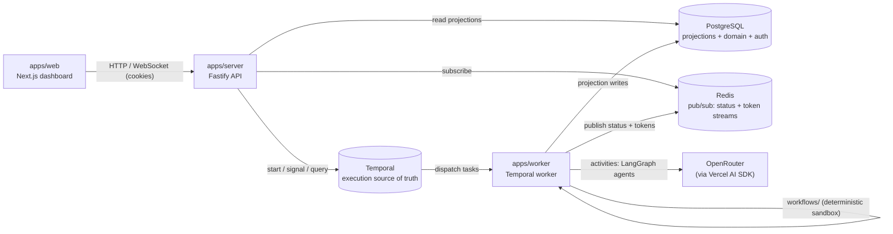

# Conductor

Run AI workflows you can trust. Conductor executes multi-step AI pipelines
(research → human approval → write → publish) as **durable [Temporal](https://temporal.io)
workflows**: runs survive worker crashes and restarts, pause at human approval
gates and resume on a click, stream live progress, and leave a complete,
replayable audit trail. Each AI step is a specialist agent — a
[LangGraph](https://langchain-ai.github.io/langgraphjs/) sub-graph that calls
models through [OpenRouter](https://openrouter.ai) via the
[Vercel AI SDK](https://sdk.vercel.ai).

> Multi-tenant from the first migration; OSS-only infrastructure (PostgreSQL,
> Redis, Temporal OSS) so the platform stays self-hostable.

## Architecture



Plain-text fallback:

```
apps/web ──HTTP/WS──> apps/server ──client──> Temporal ──dispatch──> apps/worker
                          │  └─subscribe─> Redis <─publish── activities ─┘
                          └─read──────────> PostgreSQL <─projection writes─┘
                                       activities ──LLM──> OpenRouter (AI SDK)
```

- **`apps/web`** — Next.js dashboard. Talks only to the server; never touches Temporal/Postgres/Redis.
- **`apps/server`** — Fastify API: Better Auth (orgs), REST, the Temporal *client*, the WebSocket relay, the Redis *subscriber*. No long-lived work.
- **`apps/worker`** — Temporal worker. `workflows/` is a deterministic sandbox (no I/O); `activities/` hold every side effect — LangGraph agents, OpenRouter LLM calls, Postgres/Redis writes.
- **`packages/shared`** — Zod schemas, inferred types, and constants shared across all three.
- **Temporal history is the execution source of truth**; Postgres rows are read-side projections.

## Quickstart

```bash
# 1. Infrastructure (Temporal + UI, Postgres, Redis)
docker compose -f infra/docker-compose.yml up -d
#    Temporal UI → http://localhost:8080

# 2. Dependencies + env
pnpm install
cp .env.example .env   # set OPENROUTER_API_KEY for real agent runs

# 3. Run a worker
pnpm --filter @conductor/worker start

# 4. Start a pipeline run (suspends at the approval gate), then approve it
pnpm --filter @conductor/worker run-pipeline "How durable workflows prevent lost AI runs"
pnpm --filter @conductor/worker signal-approval <workflowId> approved
```

Gate (must pass before any unit is complete): `pnpm build && pnpm typecheck && pnpm lint && pnpm test`.

## Reliability demo (kill-the-worker)

The core proof: kill the worker mid-Research, restart it, and the run completes
with the retry visible in the step history.

```bash
docker compose -f infra/docker-compose.yml up -d
CONDUCTOR_ORG_ID=org_... ./scripts/demo-reliability.sh   # an org with an OpenRouter key stored
```

The script starts a run, hard-kills the worker (`SIGKILL`) while Research is in
flight, restarts it, approves the gate, and prints the Temporal UI link so you
can inspect the recovered activity's attempts. Tunables: `TOPIC`, `KILL_DELAY`,
`RESTART_DELAY`, `APPROVE_DELAY`.

## Approval demo (pause/resume)

The human-in-the-loop proof: a run suspends at the approval gate holding no
worker slot, and resumes within seconds of the Approve call. This demo drives
the **real product API** end-to-end and is fully self-contained — it signs up
a fresh demo user, creates an org, stores its OpenRouter key (encrypted at
rest), starts a run, shows the reviewer's research context while the run is
suspended, approves it, and prints the measured decision→resume latency.

```bash
docker compose -f infra/docker-compose.yml up -d
OPENROUTER_API_KEY=sk-or-... ./scripts/demo-approval.sh
```

The key becomes the demo org's key via `PUT /orgs/api-key` and is never
printed. A server already running at `SERVER_URL` (default
`http://localhost:4000`) is reused; otherwise the script boots one. Tunables:
`TOPIC`, `KEYWORDS`, `TONE`, `WORD_COUNT`, `APPROVE_DELAY`.
